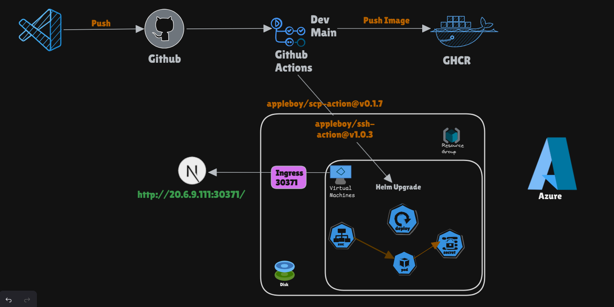
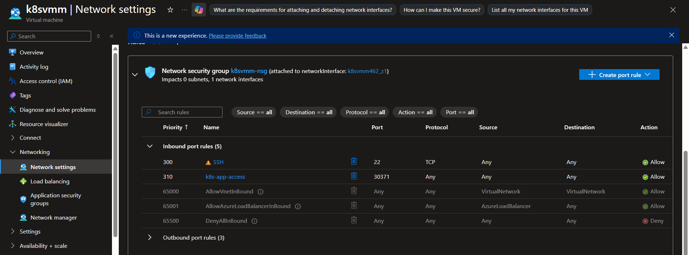
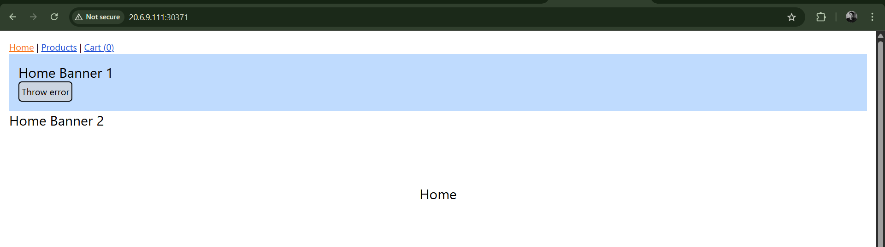

# k8s-Deploy

## Local Setup
    * Created a repository
    * Cloned it
    * Cloned a github public repository that has the nextjs application
    * Copied the files from the nextjs repo to my public repo
    * Created a dockerfile
    * Created a helm application
        helm create my-K8s-Deploy-App

## Setup instructions
    * Azure VM SetUp - 
            VM name: k8svmm (or any name)
            Region: Same as resource group
            Image: Ubuntu 22.04 LTS
            Size: Choose size (e.g., Standard B2s)
            Authentication type: SSH public key (recommended)
    
    * Docker Setup - 
            Updated the apt package list and system
            Used Below Commands -
                * for pkg in docker.io docker-doc docker-compose docker-compose-v2 podman-docker containerd runc; do sudo apt-get remove $pkg; done
                * Add Docker's official GPG key:
                sudo apt-get update
                sudo apt-get install ca-certificates curl
                sudo install -m 0755 -d /etc/apt/keyrings
                sudo curl -fsSL https://download.docker.com/linux/ubuntu/gpg -o /etc/apt/keyrings/docker.asc
                sudo chmod a+r /etc/apt/keyrings/docker.asc
                
                * Add the repository to Apt sources:
                echo \
                  "deb [arch=$(dpkg --print-architecture) signed-by=/etc/apt/keyrings/docker.asc] https://download.docker.com/linux/ubuntu \
                  $(. /etc/os-release && echo "${UBUNTU_CODENAME:-$VERSION_CODENAME}") stable" | \
                  sudo tee /etc/apt/sources.list.d/docker.list > /dev/null
                sudo apt-get update
                * sudo apt-get install docker-ce docker-ce-cli containerd.io docker-buildx-plugin docker-compose-plugin
            Create the docker group
                * sudo groupadd docker
            Add your user to the docker group
                * sudo usermod -aG docker $USER
            Run the following command to activate the changes to groups
                * newgrp docker

    * Minikube Setup -
            Commands - 
                * curl -LO https://github.com/kubernetes/minikube/releases/latest/download/minikube-linux-amd64
                sudo install minikube-linux-amd64 /usr/local/bin/minikube && rm minikube-linux-amd64
                *  minikube start --driver=docker --ports=30371:30371 (To access the application from outside the Cluster or from the browser used the custom nodeport port)

    * Kubectl Install - 
                * sudo snap install kubectl --classic
    
    * Helm To automate deployment - 
                * sudo apt-get install curl gpg apt-transport-https --yes
                curl -fsSL https://packages.buildkite.com/helm-linux/helm-debian/gpgkey | gpg --dearmor | sudo tee /usr/share/keyrings/helm.gpg > /dev/null
                echo "deb [signed-by=/usr/share/keyrings/helm.gpg] https://packages.buildkite.com/helm-linux/helm-debian/any/ any main" | sudo tee /etc/apt/sources.list.d/helm-stable-debian.list
                sudo apt-get update
                sudo apt-get install helm

    * Ran to create the GHCR secret -
                * kubectl create secret docker-registry ghcr-secret \
                --docker-server=ghcr.io \
                --docker-username=**** \
                --docker-password=GHCR_PAT \
                --docker-email=prakritimandal611@gmail.com

## CI/CD Pipeline for Next.js App with Docker and Helm
    * Prerequisites:
            GitHub Secrets: GHCR_PAT: Personal Access Token with write:packages and read:packages scopes for GitHub Container Registry (GHCR) login and push.
            AVM_HOST: Public IP of the Azure VM; AVM_SSH_KEY: SSH private key to authenticate with the VM.

    * dev branch:
        Workflow Steps:
            * Checkout repository – Retrieves the full project repository.
            * Detect changes – Checks if any workload files have changed to avoid unnecessary builds.
            Node.js setup & dependencies – Installs the specified Node version and project dependencies (npm ci).
            * Build & lint – Builds the Next.js app for production and runs linting checks.
            Docker image build & push – Builds a Docker image tagged with the commit SHA and pushes it to GitHub Container Registry (GHCR), making it public.
            * Helm values update – Updates the values.yaml with the new image name and tag.
            * Git commit & push – Automatically commits the updated Helm values to the dev branch.
            * Pull request creation – Creates an automated PR from dev to main to merge the updated workload image references.
    
    * main branch (After PR get merged to main branch): 
        Workflow Steps:
            * Checkout Repository – Pulls the latest code from the GitHub repository.
            * Transfer Application Files to Azure VM – Uses appleboy/scp-action to securely copy the Helm chart and application files to the target directory on the Azure VM.
            * Deploy or Upgrade Helm Release – Uses appleboy/ssh-action to SSH into the VM and execute Helm commands; helm upgrade --install ensures the release is installed if it doesn’t exist or upgraded if it does; the deployment waits until the resources are ready (--wait) with a timeout to prevent hanging.
            * Verify Deployment – Displays Helm release status (helm status) and lists pods associated with the deployment (kubectl get pods) for verification.
            
## Accessed the Application
    * Exposed the service associated with the deployment:  kubectl patch svc k8s-deploy-service \
    -p '{"spec": {"ports": [{"port": 80, "targetPort": 3000, "nodePort": 30371}], "type": "NodePort"}}'
    * Enabled inbound rules in the NSG (Network Security Groups)

 